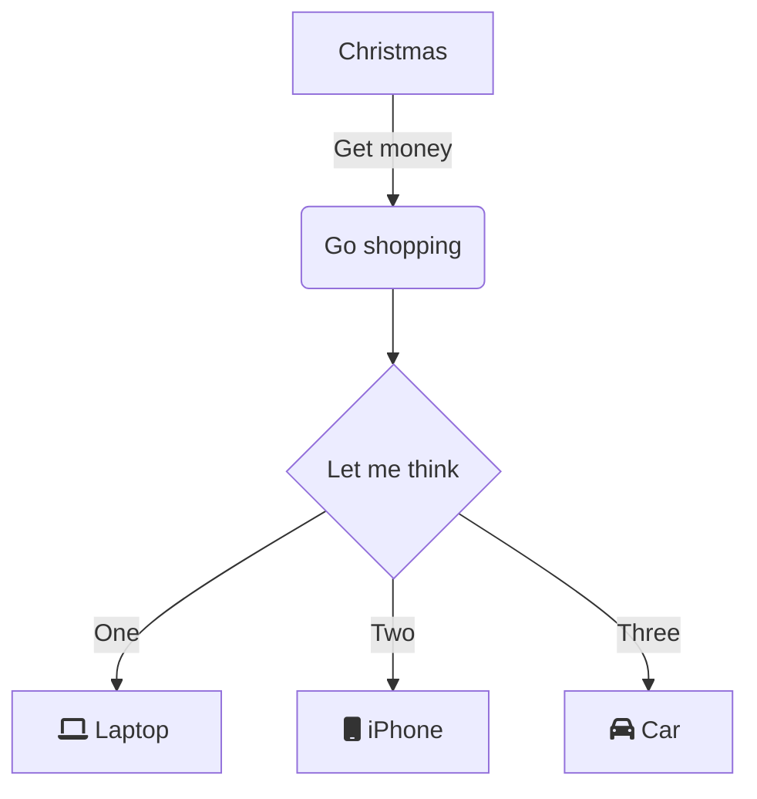

#  Markdown2Pdf.Demo

This is a demo of all the Markdown2Pdf features.

## Table of Contents <!-- omit from toc -->

<!--TOC-->

## Common Markdown Functionality

# h1 Heading
## h2 Heading
### h3 Heading
#### h4 Heading
##### h5 Heading
###### h6 Heading

### Horizontal Rules

----------

### Unordered List

* This
* is
    * my
    * unordered
        * List

### Ordered Lists

1. This
2. Is
    1. my
    2. ordered
        1. List

### Paragraphs

Lorem ipsum dolor sit amet, consectetur adipiscing elit, sed do eiusmod tempor incididunt ut labore et dolore magna aliqua. 
Ut enim ad minim veniam, quis nostrud exercitation ullamco laboris nisi ut aliquip ex ea commodo consequat. 

Duis aute irure dolor in reprehenderit in voluptate velit esse cillum dolore eu fugiat nulla pariatur. 
Excepteur sint occaecat cupidatat non proident, sunt in culpa qui officia deserunt mollit anim id est laborum.

### Text-Styling

* This Text is *italic*.
* This Text is **bold**.
* This Text is ***bold and italic***.
* This Text is ~~strike through~~.
* This Text is `code`.

### Links

This has a [Link](https://github.com/Flayms/Markdown2Pdf).

### Images


### Blockquotes

> This is a Quote.

> This is a quote,
>
> going over multiple lines

> This is a quote,
>> With a Subquote

### Code blocks

```cs
public void Main(string[] args) {
    Console.WriteLine("Hello World!");
}
```

### Tables

| Value | Type |
| --- | --- |
| "Hello World" | string |
| 7 | integer |
| true | boolean |

### Task Lists

- [x] Write the press release
- [ ] Update the website
- [ ] Contact the media

### :fire: Emojis

:clap: Supports :clap: emojis :clap: 

## Latex

$\sum_{k=0}^{n}=\frac{i}{k}$

$\displaystyle \sum_{k=0}^{n}=\frac{i}{k}$

$$\sum_{k=0}^{n}=\frac{i}{k}$$

$$
A=\begin{pmatrix}
3 & 4 \\
1 & 2
\end{pmatrix}
$$

Latex $\color{green}Color \color{blue}\text{ works}$

### In a Table

| Name | Formula |
| --- | --- |
| CNF | $(A \lor \neg B \lor C) \land (\neg A \lor B  \lor C)$ |
| Binomal coefficient | $$\binom{n}{k} = \frac{n!}{k!(n-k)!}$$ |
| Matrix | $\begin{pmatrix}-3 & 4 \\1 & -2\end{pmatrix}$ |

## Mermaid Graphs

