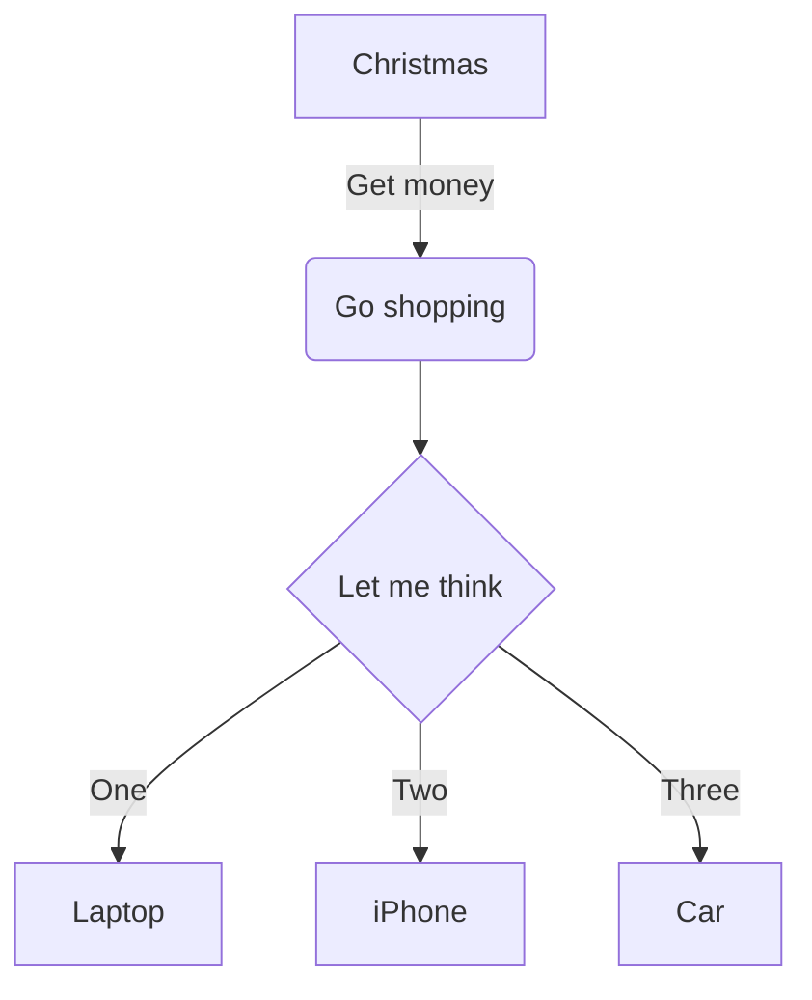

#  Markdown2Pdf.Demo

This is a demo of all the Markdown2Pdf features.

## Common Markdown Functionality

# h1 Heading
## h2 Heading
### h3 Heading
#### h4 Heading
##### h5 Heading
###### h6 Heading

### Horizontal Rules

----------

* This
* is
    * my
    * unordered
        * List

1. This
2. Is
    1. my
    2. ordered
        1. List

This is *my* **Text** with some ***special*** Markup.  
As well as another sentence and a [Link](https://github.com/Flayms/Markdown2Pdf).

And a new paragraph with `code`.

> Quotes are also available!

|My|Table|
|---|---|
|Hello|World!|

Code blocks:  

```c#
public void Main(string[] args) {
    Console.WriteLine("Hello World!);
}
```

## Latex

$\sum_{k=0}^{n}=\frac{i}{k}$

$\displaystyle \sum_{k=0}^{n}=\frac{i}{k}$

$$\sum_{k=0}^{n}=\frac{i}{k}$$

$A=
\begin{pmatrix}
3 & 4 \\\
1 & 2
\end{pmatrix}$

$\color{green}Color \color{blue}\text{ works}$

### In a Table

|Name|Struktur|
|---|---|
|CNF|$(A \lor \neg B \lor C) \land (\neg A \lor B  \lor C)$|
|Binomal coefficient|$$ \binom{n}{k} = \frac{n!}{k!(n-k)!}$$|
|Matrix|$\begin{pmatrix}-3 & 4 \\1 & -2\end{pmatrix}$
|

