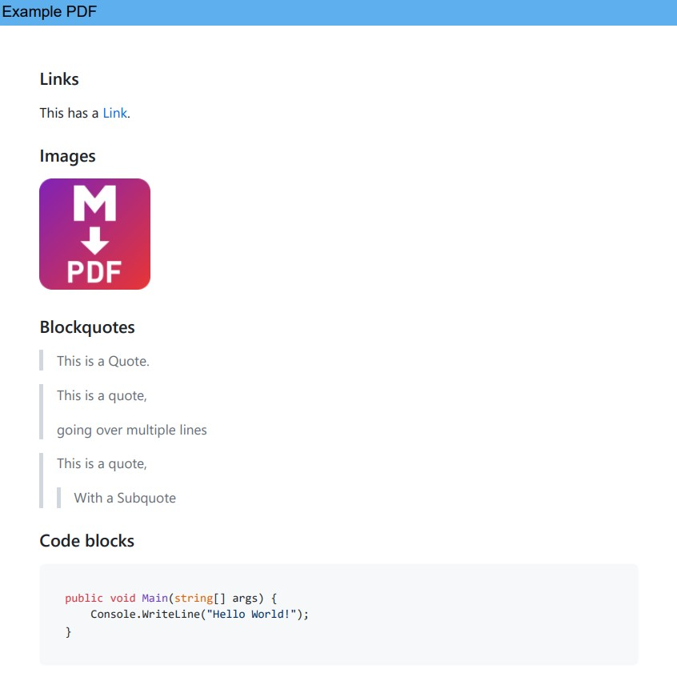

<p align="center">
  <a href="https://www.nuget.org/packages/Markdown2Pdf" target="_blank" style="all: unset;">
    
  </a>

  <a href="https://www.nuget.org/packages/Markdown2Pdf" target="_blank" style="all: unset;">
    
  </a>
  
  <a href="https://github.com/Flayms/Markdown2Pdf/actions/workflows/build-and-release.yml" target="_blank" style="all: unset;">
    
  </a>
</p>

<h1 align="center"> Markdown2Pdf</h1>

<p align="center">
  
  <br>
</p>

.NET library for converting Markdown to PDF. Uses [Markdig](https://github.com/xoofx/markdig) for converting markdown to HTML and then [Puppeteer Sharp](https://github.com/hardkoded/puppeteer-sharp) to convert that output to PDF.

For a cross-platform cli-application using this package checkout [Markdown2Pdf.Console](https://github.com/Flayms/Markdown2Pdf.Console).

<div align="center">
  
</div>

A full demo PDF can be found [here!](./assets/demo.pdf)

## Usage

C#:
```cs
var converter = new Markdown2PdfConverter();
var resultPath = await converter.Convert("README.md");
```

VB.NET:
```vb
Dim converter As New Markdown2PdfConverter()
Dim resultPath As String = Await converter.Convert("README.md")
```

> An enumeration of markdown files can also be passed to the converter, combining them into one PDF.

## Wiki

Checkout the [Wiki](https://github.com/Flayms/Markdown2Pdf/wiki) for more documentation.

## Options

To further specify the conversion process, pass [Markdown2PdfOptions](https://github.com/Flayms/Markdown2Pdf/wiki/Markdown2Pdf.Options.Markdown2PdfOptions) to the converter:

```cs
var options = new Markdown2PdfOptions {
  HeaderHtml = "<div class=\"document-title\" style=\"background-color: #5eafed; width: 100%; padding: 5px\"></div>",
  FooterHtml = "<div style=\"background-color: #5eafed; width: 100%; padding: 5px\">Page <span class=\"pageNumber\"></span>/<span class=\"totalPages\"></span></div>",
  DocumentTitle = "Example PDF",
};
var converter = new Markdown2PdfConverter(options);
```

Alternatively the [Markdown2PdfOptions](https://github.com/Flayms/Markdown2Pdf/wiki/Markdown2Pdf.Options.Markdown2PdfOptions) can be loaded from a YAML Front Matter block at the start of the markdown file:

```cs
var converter = Markdown2PdfConverter.CreateWithInlineOptionsFromFile("README.md");
var resultPath = await converter.Convert("README.md");
```

Usage examples for this can be found  [here](https://github.com/Flayms/Markdown2Pdf/wiki/Markdown2Pdf.Markdown2PdfConverter#-createwithinlineoptionsfromfilestring).

| Option                                                                                                                                           | Description                                                                                                               |
| ------------------------------------------------------------------------------------------------------------------------------------------------ | ------------------------------------------------------------------------------------------------------------------------- |
| [ChromePath](https://github.com/Flayms/Markdown2Pdf/wiki/Markdown2Pdf.Options.Markdown2PdfOptions#-chromepath)                                   | Path to chrome or chromium executable or self-downloads it if `null`.                                                     |
| [CodeHighlightTheme](https://github.com/Flayms/Markdown2Pdf/wiki/Markdown2Pdf.Options.Markdown2PdfOptions#-codehighlighttheme)                   | The theme to use for highlighting code blocks.                                                                            |
| [CustomHeadContent](https://github.com/Flayms/Markdown2Pdf/wiki/Markdown2Pdf.Options.Markdown2PdfOptions#-customheadcontent)                     | A `string` containing any content valid inside a HTML `<head>` to apply extra scripting / styling to the document.        |
| [DocumentTitle](https://github.com/Flayms/Markdown2Pdf/wiki/Markdown2Pdf.Options.Markdown2PdfOptions#-documenttitle)                             | The title of this document. Can be injected into the header / footer by adding the class `document-title` to the element. |
| [EnableAutoLanguageDetection](https://github.com/Flayms/Markdown2Pdf/wiki/Markdown2Pdf.Options.Markdown2PdfOptions#-enableautolanguagedetection) | Auto detect the language for code blocks without specfied language.                                                       |
| [FooterHtml](https://github.com/Flayms/Markdown2Pdf/wiki/Markdown2Pdf.Options.Markdown2PdfOptions#-footerhtml)                                   | HTML-string to use as the document footer.                                                                                |
| [Format](https://github.com/Flayms/Markdown2Pdf/wiki/Markdown2Pdf.Options.Markdown2PdfOptions#-format)                                           | The paper format for the PDF.                                                                                             |
| [HeaderHtml](https://github.com/Flayms/Markdown2Pdf/wiki/Markdown2Pdf.Options.Markdown2PdfOptions#-headerhtml)                                   | HTML-string to use as the document header.                                                                                |
| [IsLandscape](https://github.com/Flayms/Markdown2Pdf/wiki/Markdown2Pdf.Options.Markdown2PdfOptions#-islandscape)                                 | Paper orientation.                                                                                                        |
| [KeepHtml](https://github.com/Flayms/Markdown2Pdf/wiki/Markdown2Pdf.Options.Markdown2PdfOptions#-keephtml)                                       | `true` if the created HTML should not be deleted.                                                                         |
| [MarginOptions](https://github.com/Flayms/Markdown2Pdf/wiki/Markdown2Pdf.Options.Markdown2PdfOptions#-marginoptions)                             | Css-margins for the sides of the document.                                                                                |
| [ModuleOptions](https://github.com/Flayms/Markdown2Pdf/wiki/Markdown2Pdf.Options.Markdown2PdfOptions#-moduleoptions)                             | Options that decide from where to load additional modules. [More Information](#modules).                                  |
| [Scale](https://github.com/Flayms/Markdown2Pdf/wiki/Markdown2Pdf.Options.Markdown2PdfOptions#-scale)                                             | Scale of the content. Must be between 0.1 and 2.                                                                          |
| [TableOfContents](https://github.com/Flayms/Markdown2Pdf/wiki/Markdown2Pdf.Options.Markdown2PdfOptions#-tableofcontents)                         | Creates a TOC from the markdown headers. [More Information](#table-of-contents).                                          |
| [Theme](https://github.com/Flayms/Markdown2Pdf/wiki/Markdown2Pdf.Options.Markdown2PdfOptions#-theme)                                             | The styling to apply to the document.                                                                                     |

## Table of contents

To add a table of contents insert
* `[TOC]` (Gitlab Syntax)
* `[[_TOC_]]` (Gitlab Syntax)
* or `<!-- toc -->` (Comment)

into the markdown document and use the `Markdown2PdfOptions.TableOfContents` option:

```md
# My Document

[TOC]
...
```

Example creating a TOC:

```cs
options.TableOfContents = new TableOfContentsOptions {
  ListStyle = ListStyle.Decimal,

  // Include all heading levels from 2 to 4.
  MinDepthLevel = 2,
  MaxDepthLevel = 4
};
```

A header can be omitted from the toc by ending it with `<!-- omit from toc -->`:
```md
## This header won't be displayed in the TOC <!-- omit from toc -->
```

The TOC gets generated within a `<nav class="table-of-contents">`. This can be used to apply extra custom styles.

### Options

| Option                                                                                                                          | Description                                               |
| ------------------------------------------------------------------------------------------------------------------------------- | --------------------------------------------------------- |
| [HasColoredLinks](hhttps://github.com/Flayms/Markdown2Pdf/wiki/Markdown2Pdf.Options.TableOfContentsOptions#-hascoloredlinks)    | If set, the titles in the TOC get default link markup.    |
| [ListStyle](https://github.com/Flayms/Markdown2Pdf/wiki/Markdown2Pdf.Options.TableOfContentsOptions#-liststyle)                 | Decides which characters to use before the TOC titles.    |
| [MaxDepthLevel](https://github.com/Flayms/Markdown2Pdf/wiki/Markdown2Pdf.Options.TableOfContentsOptions#-maxdepthlevel)         | The maximum level of heading depth to include in the TOC. |
| [MinDepthLevel](https://github.com/Flayms/Markdown2Pdf/wiki/Markdown2Pdf.Options.TableOfContentsOptions#-mindepthlevel)         | The minimum level of heading depth to include in the TOC. |
| [PageNumberOptions](https://github.com/Flayms/Markdown2Pdf/wiki/Markdown2Pdf.Options.TableOfContentsOptions#-pagenumberoptions) | If set, the TOC will be generated with page numbers.      |

## Modules

This library uses *node_modules* packages.
By default they're loaded over the CDN they're hosted on e.g. <https://cdn.jsdelivr.net>.

You can also use a local installation by installing the following packages and setting [Markdown2PdfOptions.ModuleOptions](https://github.com/Flayms/Markdown2Pdf/wiki/Markdown2Pdf.Options.Markdown2PdfOptions#-moduleoptions) to [ModuleOptions.FromLocalPath()](https://github.com/Flayms/Markdown2Pdf/wiki/Markdown2Pdf.Options.ModuleOptions#-fromlocalpathstring):

```bash
npm i mathjax@3
npm i mermaid@10
npm i font-awesome
npm i @highlightjs/cdn-assets@11
npm i github-markdown-css
npm i latex.css
```

> **Note:** For this you need to have *npm* installed and added to `PATH`.

| Module                                                                     | Description                               |
| -------------------------------------------------------------------------- | ----------------------------------------- |
| [MathJax](https://github.com/mathjax/MathJax)                              | Latex-Math rendering                      |
| [Mermaid](https://github.com/mermaid-js/mermaid)                           | Diagrams                                  |
| [Font-Awesome](https://fontawesome.com/)                                   | Icons (Supported within mermaid diagrams) |
| [Highlight.js](https://github.com/highlightjs/highlight.js)                | Syntax highlighting                       |
| [github-markdown-css](https://github.com/sindresorhus/github-markdown-css) | Github-Theme                              |
| [latex-css](https://github.com/vincentdoerig/latex-css)                    | Latex-Theme                               |

### Further modification

To get more control over the HTML generation (e.g. to add your own JS-Scripts), modify the [converter.ContentTemplate](https://github.com/Flayms/Markdown2Pdf/wiki/Markdown2Pdf.Markdown2PdfConverter#-contenttemplate).

## Unit-Tests

For automated tests, the project [Markdown2Pdf.Tests](Markdown2Pdf.Tests/) exists.
Before starting these, run [setup.ps1](Markdown2Pdf.Tests/setup.ps1).

## Running in Docker

The bundled Chromium that gets installed by Puppeteer doesn't ship with all necessary dependencies (See [Running Puppeteer in Docker](https://github.com/puppeteer/puppeteer/blob/main/docs/troubleshooting.md#running-puppeteer-in-docker)).

To resolve this install them in your `.dockerfile`:

```dockerfile
RUN apt-get update \
    && apt-get install -y wget gnupg \
    && wget -q -O - https://dl-ssl.google.com/linux/linux_signing_key.pub | apt-key add - \
    && sh -c 'echo "deb [arch=amd64] http://dl.google.com/linux/chrome/deb/ stable main" >> /etc/apt/sources.list.d/google.list' \
    && apt-get update \
    && apt-get install -y google-chrome-stable fonts-ipafont-gothic fonts-wqy-zenhei fonts-thai-tlwg fonts-kacst fonts-freefont-ttf libxss1 \
      --no-install-recommends \
    && rm -rf /var/lib/apt/lists/*
```

## Why is Chromium needed

Markdown was initially developed so that it can be converted to HTML. Resulting from that, a lot of its tooling exists within the JavaScript world. For instance, [Mermaid](https://github.com/mermaid-js/mermaid) is only implemented in JavaScript, so we need a JS-engine to support it. This results in this package being slower but also able to support more features than other solutions that directly generate the PDF from Markdown.
